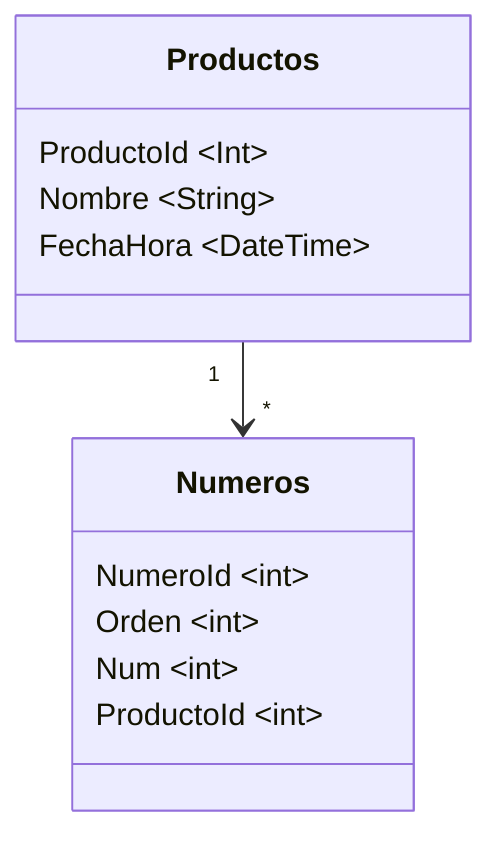

# Tarea Programada 3

| Curso                           | Programación Avanzada               |
| :------------------------------ | :---------------------------------- |
| Código                          | SC-601                              |
| Profesor                        | Luis Andrés Rojas Matey             |
| Fecha y hora de entrega inicial | Miércoles 18 de junio a las 9:00 pm |
| Fecha y hora de entrega final   | Miércoles 25 de junio a las 6:00 pm |

<br />

## Introducción

Los juegos de azar son uno de los nichos de la teoría de juegos. Estos se caracterizan por tener el factor de aleatoriedad. En Costa Rica, la Junta de Protección Social (JPS) debe llevar un registro de todos los eventos respecto a sus juegos.

<br />

## Objetivo

Aplicar los conocimientos adquiridos del uso de la herramienta `Entity Framework 6` (`EF6`) con el `.NET Framework 4.8.1`.

<br />

## Especificaciones funcionales

Este será un programa en `Consola`, el cual permitirá guardar en una base de datos los productos de varios juegos de azar, así como generar y guardar los números que salieron favorecidos en dichos juegos.

Para cumplir con lo anterior, se utilizará el procedimiento de _Code First_, el cual consiste en crear primero las clases (_class_ de `C#`) y el contexto (_DbContext_) para definir las **Entidades**, que la herramienta `EF6` reconocerá para generar y utilizar las respectivas tablas en una base de datos.

Así mismo, el **Programa** (en `Consola`) permitirá el llenado con preguntas interactivas al usuario. Además, mostratrá el contenido de la base de datos.

<br />

## Entidades

Estas se harán a partir de clases de `C#`, las cuales deben ser capaces de generar algo similar al siguiente esquema en la base de datos (se puede observar que no contienen tildes):



<br />

## Programa

Una vez se ejecuta el programa, se le harán cuatro (4) preguntas al usuario, en este orden:

1. El nombre del **Producto**.

2. La cantidad de **Números** aleatorios.

3. Si los **Números** aleatorios se pueden repetir.

4. Si desea agregar otro **Producto**.

<br />

### 1. El nombre del **Producto**

Este será una respuesta de tipo _String_. Como el objeto **Producto** también tiene un _DateTime_, este será la fecha y hora actuales. Ejemplo:

```
Escriba el nombre del producto. R/ Lotto
```

<br />

### 2. La cantidad de **Números** aleatorios

Esta respuesta será un número natural, mayor que cero (0). Ejemplo:

```
Escriba la cantidad de números aleatorios a generar. R/ 5
```

Estos números a generar deberán estar en el rango del cero (0) al noventa y nueve (99).

<br />

### 3. Si los **Números** aleatorios se pueden repetir

Este será una respuesta de "sí o no", representados por las letras `s` o `n`. Debe ser _case insensitive_, es decir, también serían válidas `S` o `N`. Esta pregunta es mostrada si la cantidad de números aleatorios a generar es menor o igual que 100. Ejemplo:

```
¿Los números se pueden repetir? (s/n). R/ n
```

Una vez se indique esta respuesta, se procederá a generar los **Números** y asignarlos al **Producto**. Cada número tendrá un orden, que es el índice conforme fue generado, empezando por el uno (1).

<br />

### 4. Si desea agregar otro **Producto**

Esta también será una respuesta de "sí o no" (`s` o `n`, _case insensitive_). Si la respuesta es afirmativa (`s`), entonces se procede de nuevo desde el punto **# 1**. De lo contrario, si la respuesta es negativa, entonces deben suceder tres (3) cosas:

A. Guardar el **Producto** con sus respectivos **Números** en la base de datos.

B. Mostrar todos los **Productos** y sus **Números** guardados en la base de datos, ordenados por fecha/hora de creación. Para esta parte, se debe mostrar:

- Id del **Producto**.
- Nombre del **Producto**.
- Fecha y hora de creación, en cualquier formato.
  - Id del **Número**.
  - Orden del **Número**.
  - Valor del **Número**.

C. El programa indicará que finalizó y le solicita al usuario que digite cualquier tecla para terminar.

Ejemplo:

```
¿Desea agregar otro producto? R/ n

1. Lotto - 2025/06/18 18:00
    1. [1] 25
    2. [2] 3
    3. [3] 0
    4. [4] 12
    5. [5] 33

2. Lotto - 2025/06/18 18:05
    6. [1] 1
    7. [2] 7
    8. [3] 5
    9. [4] 28
    10. [5] 17

3. Chances - 2025/06/18 18:05
    11. [1] 99
    12. [2] 0
    13. [3] 50

Programa finalizado. Presione la tecla enter para terminar.
```

<br />

## Especificaciones técnicas

- El trabajo se debe realizar con el lenguaje de programación `C#`, en modo `Consola`, utilizando `Entity Framework 6` y el `.NET Framework 4.8.1`.

- Debe contener un _solution_ y un _project_, así como el _project_ incluido en el _solution_.

- Se debe utilizar la técnica _Class First_ y la base de dato se debe llamar `TP3`. No se deben utilizar _Migrations_.

- Se requiere usar el IDE [Visual Studio](https://visualstudio.microsoft.com/vs/).

<br />

## Entregables

Al ser una tarea de carácter individual, se debe entregar un único archivo comprimido **ZIP** con el siguiente nombre: `TP3-[Carné].zip`. Ejemplo de nombre del archivo **ZIP**: `TP3-FH12345678.zip`.

El mismo debe contener lo siguiente:

- Todo el código fuente que incluya el archivo _solution_ y la carpeta del _project_. Sin embargo, no debe contener los archivos compilados, es decir, excluir las carpetas `bin` y `obj`.

- `README.md`. La documentación en [Markdown](https://www.markdownguide.org) donde se indique lo siguiente:

  - Su nombre, carné y el enlace al repositorio si lo subió a `GitHub`, `GitLab` o algún otro proveedor.

  - Páginas web donde halló posibles soluciones a problemas encontrados o _snippets_ de código.

  - _Prompts_ (consultas y respuestas) de los _chatbots_ de IA (`Copilot`, `Gemini`, `ChatGPT`, etc.) que haya utilizado.

<br />

## Evaluación

El proyecto será calificado según la rúbrica que se presenta en el programa del curso.
